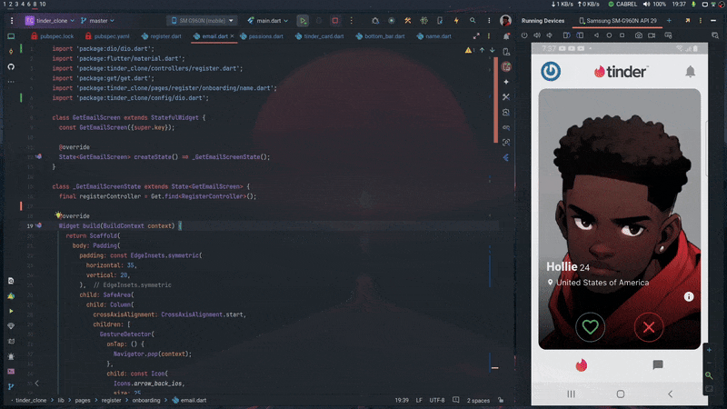

# Tinder Clone (Flutter)

A simple Tinder clone application featuring card swipe functionality. Users can swipe left or right to indicate their interest in different profiles.

## Project Description

This Tinder clone is built using Flutter for the frontend, providing a seamless and responsive user experience across both mobile and web platforms. The app mimics the core functionality of Tinder, allowing users to browse through profiles and swipe right to like or swipe left to reject. It includes smooth animations and a clean, modern design.

### Key Features

- **Swipe Functionality**: Swipe left to reject a profile and swipe right to like a profile.
- **Profile Cards**: Display user profiles with images, names, and brief descriptions.
- **Responsive Design**: Optimized for both mobile and desktop views.
- **Smooth Animations**: Provides a visually appealing and interactive user experience.

## Demo

Check out the app in action:

